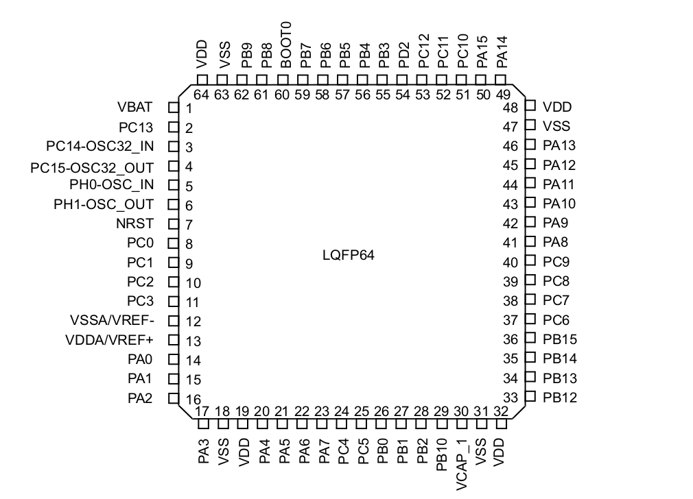

# Lab 1: Identifying PINs
- chip: LQFP64
*__SMALL DOT ON PIN_1__*
*__BIGGER DOT ON PIN_32__*

##### USART1 
(probably one of the 8 PINed connectors)
- USART1_TX: PIN_50 (PA15)
- USART1_RX: PIN_43 (PA10)

##### USART6 
(probably one of the 8 PINed connectors)
- USART6_TX: PIN_37 (PC6)
- USART6_RX: PIN_38 (PC7)
- 
##### USART2 <-- Use this one
(4 PINed connection)
- USART1_TX: PIN_16 (PA2)
- USART1_RX: PIN_17 (PA3)
